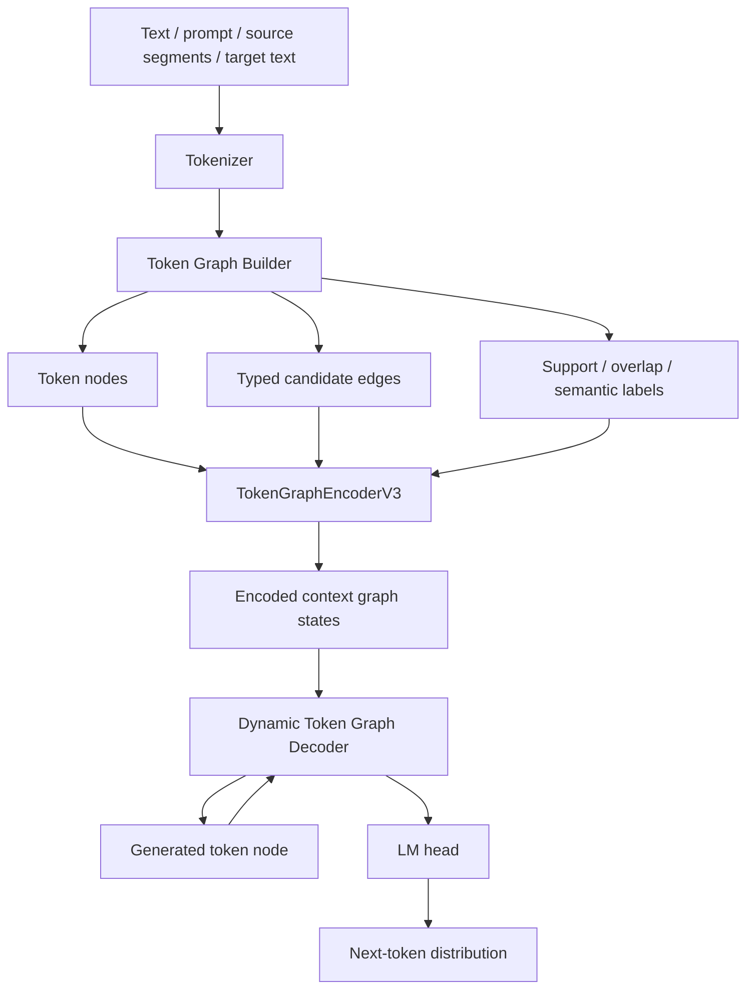
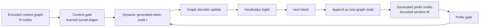

# TMCRA TokenGraph-LLM

[](https://github.com/reshuibuduo/TMCRA-TokenGraph-LLM)
[](https://github.com/reshuibuduo/TMCRA-TokenGraph-LLM/releases/tag/v0.2.0-stagec)
[](https://huggingface.co/2009YU/TMCRA-TokenGraph-LLM)
[](LICENSE)

TMCRA TokenGraph-LLM is an experimental graph-native autoregressive language model prototype. It is not a Transformer wrapper and does not call an external LLM at inference time. Text is generated from token-level graph encoding, learned edge gates, graph message passing, and a dynamic graph causal decoder.

The current default line is **Stage C / Dynamic Token Graph Decoder V3**. Stage C has about `114.6M` parameters and was trained on a million-scale token graph corpus with next-token, graph-state, tunnel, edge-type, and next-token-node objectives. It is still an early research prototype, not a polished SDK and not a production LLM.

## What This Project Does

- Builds token-level graphs from text and instruction-style corpora.
- Trains a graph-native autoregressive decoder without Transformer self-attention.
- Keeps next-token prediction as the main objective.
- Learns edge activation over typed candidate token edges.
- Treats generated tokens as graph nodes during dynamic decoding.
- Adds graph objectives:
  - graph-state token prediction
  - support-node scoring
  - answer-overlap scoring
  - decoder-to-context tunnel alignment
  - next-token-to-node alignment
  - edge-type prediction
- Provides token attribution for generated text: generated token -> top graph nodes -> incident graph edges.

## Architecture Diagrams

Overall Stage C path:



Single next-token decoding step:



## Detailed Next-Token Mechanism

Stage C predicts the next token through a graph-native causal path:

```text
schema2 text
  -> token graph nodes and typed candidate edges
  -> learned edge-gated graph propagation
  -> dynamic generated-token graph nodes
  -> prefix-edge + context-edge gated decoding
  -> vocabulary logits for the next token
```

1. **Token graph construction.** The input prompt, source segments, text units, optional knowledge tokens, and optional teacher semantic spans are converted into token-level graph nodes. Candidate edges include lexical, unit, semantic, causal-target, knowledge, and typed relation edges. These edges are candidates, not fixed reasoning rules.

2. **Node initialization.** Each graph node starts from token embedding plus node-type embedding:

```text
h_i^0 = norm(token_emb(token_i) + node_type_emb(type_i))
```

3. **Learned edge activation.** For every candidate edge `(i -> j)`, the graph layer computes a learned gate from source node, destination node, and edge-type embedding:

```text
gate_ij = sigmoid(MLP([h_i, h_j, edge_type_emb(e_ij)]))
message_ij = MLP([h_i, edge_type_emb(e_ij)]) * gate_ij
```

Messages are aggregated into destination nodes and passed through graph layers. This is where the model learns which token relations matter; the graph builder proposes edges, but the model decides their strength.

4. **Context graph state.** After graph propagation, the encoded node states become the context graph. The model also scores context nodes for support and answer-overlap signals. These scores form a graph prior over which context nodes should influence generation.

5. **Generated tokens become dynamic graph nodes.** During teacher-forced training, target-prefix tokens can be inserted as causal target-prefix graph nodes. During inference, already generated tokens are represented as decoder-side answer nodes. They are not handled by Transformer self-attention; they are processed by graph-style prefix gates and context gates.

6. **Prefix-edge decoding.** For each generated position `t`, the decoder looks back over a bounded generated-token prefix window and learns which previous generated-token nodes should influence the current node:

```text
prefix_msg_t = weighted_sum(previous_generated_nodes, learned_prefix_gate)
```

7. **Context-edge decoding.** The current generated-token node also opens learned tunnel/context edges to encoded context graph nodes:

```text
context_msg_t = weighted_sum(context_nodes, learned_context_gate + graph_prior)
```

8. **Next-token logits.** The generated-token node is updated from its current state, prefix message, and context message. A language head maps the updated graph-decoder state to vocabulary logits:

```text
d_t = GraphDecoderBlock(token_state_t, prefix_msg_t, context_msg_t)
logits_t = LMHead(norm(d_t))
next_token = argmax(logits_t) or sampled(logits_t)
```

9. **Training losses.** The main objective is next-token prediction. Auxiliary losses train graph-state prediction, support-node scoring, overlap scoring, decoder-to-context tunnel alignment, next-token-to-node alignment, and edge-type prediction. These losses are meant to make language generation depend on graph structure rather than only on local token frequency.

The current implementation still has a normal vocabulary projection head, because any autoregressive language model needs a distribution over token ids. The difference is that the hidden state feeding that projection is produced by typed graph propagation and dynamic graph decoding, not Transformer self-attention.

## Complexity Compared With Transformer Attention

Transformer decoders usually apply dense self-attention over the sequence. If `n` is sequence length and `d` is hidden dimension, the attention interaction cost grows roughly as:

```text
Transformer self-attention per layer: O(n^2 * d)
```

TGCLM Stage C does not compute all token-pair attention over the full sequence. It uses a candidate token graph and learned edge gates. Let:

- `N` = encoded context graph nodes;
- `E` = candidate graph edges;
- `T` = generated token count;
- `W` = bounded generated-prefix window;
- `d` = hidden dimension;
- `L_g` = graph encoder layers;
- `L_d` = dynamic graph decoder layers.

The current implementation is approximately:

```text
Graph encoder:        O(L_g * (N + E) * d)
Dynamic prefix path:  O(L_d * T * W * d)
Context tunnel path:  O(L_d * T * N * d)
```

If the builder keeps `E = O(kN)` with small average degree `k`, graph encoding grows close to linear in the number of graph nodes instead of quadratic in all token pairs. The generated prefix path is also bounded by `W`, so it avoids `O(T^2)` generated-token self-attention. The current context tunnel still scans encoded context nodes for each generated position, so it is not free; future sparse/top-k context tunneling can reduce that term.

| Mechanism | Main interaction pattern | Growth driver |
|---|---|---|
| Transformer decoder | dense all-token self-attention | `O(n^2 * d)` |
| TGCLM graph encoder | message passing over candidate edges | `O((N + E) * d)` per graph layer |
| TGCLM dynamic prefix decoder | bounded generated-token graph window | `O(T * W * d)` per decoder layer |
| TGCLM context tunnel decoder | generated token to encoded context graph | `O(T * N * d)` per decoder layer |

This means the current benefit is not a blanket claim of constant-time generation. The concrete architectural difference is that TGCLM replaces dense sequence-wide self-attention with typed graph candidate edges, learned edge activation, bounded prefix graph messages, and explicit context tunneling.

## Current Status

The Stage C prototype can generate longer English text than the earlier v0.1 checkpoint, and graph ablations show that typed graph edges materially affect generation. It is still not a usable general LLM. Current weaknesses include exact factual answering, stable long-range coherence, robust instruction following, strong grammar, multilingual generation, and reliable concept binding.

The strongest current behavior is story-style continuation. The weakest behavior is precise QA, numeric/factual answers, structured lists, and abstract definitions.

## Released Checkpoints

The current Stage C checkpoint is published separately from the source tree:

[](https://github.com/reshuibuduo/TMCRA-TokenGraph-LLM/releases/download/v0.2.0-stagec/tgclm_stagec_model_package_20260606.zip)
[](https://huggingface.co/2009YU/TMCRA-TokenGraph-LLM)

The source repository intentionally excludes `.pt` checkpoints and raw corpora. The release package is model-only: checkpoint, tokenizer, dataset manifest, training summary, checksum, and evaluation notes. Full-chain training code lives in this source repository.

Previous release:

- `v0.1.0-prototype` is now treated as the legacy small prototype checkpoint package.

## Current Stage C Training Scale

The Stage C checkpoint was trained with:

- parameters: `114,615,372`
- model shape: `dim=512`, `graph_layers=8`, `decoder_layers=10`
- embeddings: untied
- precision: `bf16`
- effective training samples: about `1.03M`
- training steps: `62,000`
- checkpoint: `token_graph_dynamic_decoder_v3.pt`
- tokenizer: packaged with the Stage C dataset manifest

Observed capability is still early-stage. It can generate story-like English continuations and shows measurable graph-edge dependence, but it is not a reliable factual QA model.

## Current Smoke Evaluation

Stage A/B/C loss and graph ablation smoke:

| model | variant | total loss | lm loss |
|---|---|---:|---:|
| StageA | normal | 10.666509 | 7.587883 |
| StageB | normal | 10.228030 | 7.297534 |
| StageC | normal | 6.512117 | 4.641285 |
| StageC | no_edges | 8.310654 | 5.790666 |
| StageC | shuffle_edges | 7.702783 | 5.169387 |

TinyStories validation smoke:

| variant | avg words | avg gold overlap |
|---|---:|---:|
| normal | 73.88 | 0.1835 |
| no_edges | 38.12 | 0.1499 |
| shuffle_edges | 63.62 | 0.1618 |

BLiMP likelihood smoke:

| task | accuracy |
|---|---:|
| determiner_noun_agreement_1 | 59% |
| anaphor_number_agreement | 63% |
| regular_plural_subject_verb_agreement_1 | 64% |

These numbers are smoke tests, not leaderboard claims. They show early language behavior and graph-edge dependence, while also showing that Stage C is not yet a mature LLM.

## Repository Layout

```text
src/token_graph_llm/
  native_token_graph_common.py       tokenizer utilities
  token_graph_llm_model_v1.py        graph encoder + graph causal decoder + losses
  train_token_graph_llm_v1.py        training / finetuning entry point
  model_token_graph_dynamic_decoder_v3.py
  train_token_graph_dynamic_decoder_v3.py
  train_graph_causal_decoder_v2.py
  eval_dynamic_v3_compare_ablation.py
  eval_stagec_tinystories_smoke_v3.py
  eval_stagec_blimp_likelihood_v3.py
  generalization_eval_probe_v1.py    anti-copy / generalization probe
  token_attribution_v1.py            token-level graph attribution

scripts/
  build_schema2_from_open_longtext_parquets.py
  build_schema2_from_cosmopedia_parquets.py
  build_general_ability_schema2_from_hf.py
  build_general_ability_schema2_from_hf_parquets.py
  compose_long_multitask_schema2.py
  annotate_token_semantic_graph_with_openai.py
  annotate_token_semantic_graph_with_local_hf.py
  build_native_token_reasoning_graph_dataset_v3.py
  build_native_token_reasoning_graph_dataset_v3_parallel.py
  build_native_token_reasoning_graph_dataset_v3_resume_spill.py
  run_stagec_full_chain_template.sh
  run_stagec_sharded_training_template.sh
  download_hf_sources.py

examples/
  generalization_probe_prompts.jsonl

docs/
  FULL_CHAIN_TRAINING.md
  FULL_CHAIN_TRAINING_ZH.md
  TGCLM_STAGEC_TECHNICAL_OVERVIEW.md
  TGCLM_STAGEC_TECHNICAL_OVERVIEW_ZH.md
  STAGEC_DETAILED_BENCHMARK_SMOKE_20260606.md
  TOKEN_LEVEL_SEMANTIC_GRAPH_SCHEMA.md
  ARCHITECTURE_RUNTIME_ZH.md
  OPEN_CORPUS_10M_CANDIDATES.md

models/
  README.md
```

## Requirements

Python 3.10+ is recommended.

Install the minimal runtime:

```bash
pip install -r requirements.txt
```

For GPU training, install a PyTorch build matching your CUDA environment from the official PyTorch instructions.

For the full data-conversion / optional teacher-annotation path:

```bash
pip install -r requirements-full-chain.txt
```

The optional `transformers` dependency is only for local teacher annotation. The TokenGraph-LLM model itself remains graph-native and does not wrap a Transformer decoder.

## Data Schema

The graph builder expects JSONL records with these preferred fields:

```json
{
  "query": "instruction or prompt",
  "source_segments": ["optional supporting text"],
  "text_units": ["optional unit-level text spans"],
  "target_text": "text to train the decoder to generate"
}
```

Legacy fields such as `answer`, `memory_nodes`, or `event_units` are compatibility paths only. New datasets should use `source_segments`, `text_units`, and `target_text`.

## Build A Small Dataset

Run from the `scripts` directory:

```bash
cd scripts
python build_native_token_reasoning_graph_dataset_v3.py \
  --input-jsonl /path/to/input.jsonl \
  --out-dir /path/to/dataset_out \
  --limit 3000 \
  --vocab-size 1024 \
  --min-pair-freq 5 \
  --tokenizer-kind hf_bpe \
  --tokenizer-text-limit 1000 \
  --tokenizer-char-budget 250000
```

Expected output:

```text
tokenizer.json
train.base.jsonl
val.base.jsonl
annotation_input.jsonl
manifest.json
```

For larger corpora, use the parallel/resume-spill builders in `scripts/`.

## Full-Chain Training Pipeline

The public full-chain path is documented in [docs/FULL_CHAIN_TRAINING.md](docs/FULL_CHAIN_TRAINING.md). It covers:

- converting open text or QA corpora to schema2 JSONL;
- optional semantic teacher annotation through an OpenAI-compatible endpoint or local Hugging Face model;
- building token-level reasoning graph datasets;
- Stage C training with `simple_plus_causal_target` graph mode;
- graph ablation and token attribution evaluation.

The runnable templates are:

```bash
bash scripts/run_stagec_full_chain_template.sh
bash scripts/run_stagec_sharded_training_template.sh
```

## Train Stage C Style

Run from `src/token_graph_llm`:

```bash
cd src/token_graph_llm
python train_token_graph_dynamic_decoder_v3.py \
  --dataset-dir /path/to/dataset_out \
  --out-dir /path/to/run_out \
  --streaming-train \
  --max-steps 62000 \
  --batch-size 4 \
  --grad-accum-steps 4 \
  --dim 512 \
  --graph-layers 8 \
  --decoder-layers 10 \
  --untie-embeddings \
  --amp bf16 \
  --lr 0.0002 \
  --label-smoothing 0.02 \
  --graph-state-weight 0.35 \
  --next-token-node-weight 0.08 \
  --edge-type-weight 0.05
```

The run directory will contain:

```text
token_graph_dynamic_decoder_v3.pt
summary.json
```

## Continue From A Checkpoint

```bash
python train_token_graph_dynamic_decoder_v3.py \
  --dataset-dir /path/to/dataset_out \
  --out-dir /path/to/finetune_out \
  --init-checkpoint /path/to/token_graph_dynamic_decoder_v3.pt \
  --streaming-train \
  --max-steps 1000 \
  --dim 512 \
  --graph-layers 8 \
  --decoder-layers 10 \
  --untie-embeddings
```

The architecture parameters must match the checkpoint.

## Generalization Probe

```bash
python generalization_eval_probe_v1.py \
  --run-dir /path/to/run_out \
  --dataset-dir /path/to/dataset_out \
  --prompts-jsonl ../../examples/generalization_probe_prompts.jsonl \
  --out-json /path/to/run_out/generalization_probe_v1.json \
  --train-neighbor-scan 10000
```

This probe checks whether outputs are simple training-sample copies by reporting nearest training prompt similarity, prompt copy ratio, new-token ratio, and repetition ratio.

## Token Attribution

```bash
python token_attribution_v1.py \
  --run-dir /path/to/run_out \
  --dataset-dir /path/to/dataset_out \
  --out-json /path/to/run_out/token_attribution_v1.json \
  --out-html /path/to/run_out/token_attribution_v1.html
```

The HTML output shows top graph nodes and incident edges for each generated token.

## Model Checkpoints

Checkpoints are intentionally excluded from this source package. Use the released checkpoint package linked above, or publish compatible checkpoints as separate GitHub Release assets / Hugging Face model files.

## Security And Privacy

This package is intended to contain source code, documentation, and small examples only. Before publishing, run a local secret scan and confirm that no credentials, internal hostnames, private logs, or raw training dumps are included.

## License

MIT License. See `LICENSE`.
