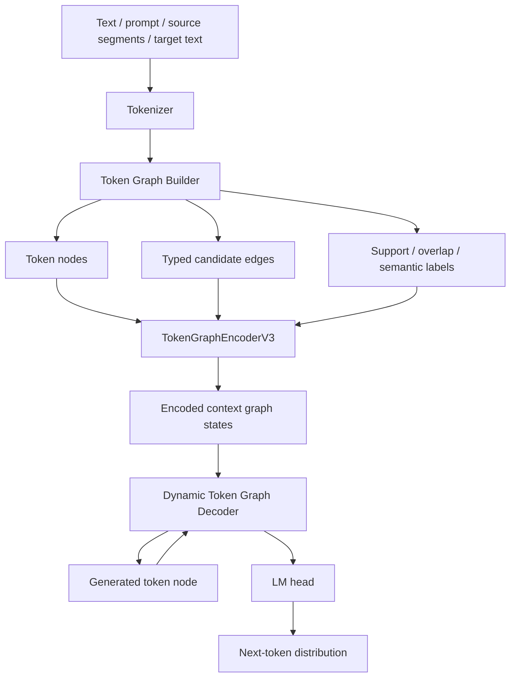
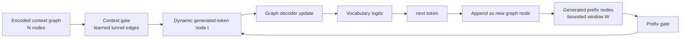

# TMCRA TokenGraph-LLM

[](https://github.com/reshuibuduo/TMCRA-TokenGraph-LLM)
[](https://github.com/reshuibuduo/TMCRA-TokenGraph-LLM/releases/tag/v0.2.0-stagec)
[](https://huggingface.co/2009YU/TMCRA-TokenGraph-LLM)
[](LICENSE)

TMCRA TokenGraph-LLM 是一个实验性的图原生自回归语言模型。它不是 Transformer 外壳，也不会在推理时调用外部 LLM。文本生成来自 token 级图编码、学习式边门控、图消息传递和动态图因果解码器。

当前默认路线是 **Stage C / Dynamic Token Graph Decoder V3**。Stage C 约 `114.6M` 参数，在百万级 token graph 语料上训练，联合使用 next-token、graph-state、tunnel、edge-type 和 next-token-node 目标。它仍然是研究原型，不是成熟 SDK，也不是生产可用 LLM。

## 项目作用

- 把文本和指令式语料构造成 token-level graph。
- 训练不依赖 Transformer self-attention 的图原生自回归 decoder。
- 让生成 token 本身也成为动态图节点。
- 学习 typed candidate edges 的边激活，而不是把图边当固定规则。
- 保持 next-token prediction 为主目标。
- 增加图结构训练目标：
  - graph-state token prediction
  - support-node scoring
  - answer-overlap scoring
  - decoder-to-context tunnel alignment
  - next-token-to-node alignment
  - edge-type prediction
- 提供 token attribution：generated token -> top graph nodes -> incident graph edges。

## 架构图

Stage C 总体链路：



单步 next-token 解码链路：



## 详细 Next-Token 机制

Stage C 通过图原生因果链路预测下一个 token：

```text
schema2 text
  -> token graph nodes and typed candidate edges
  -> learned edge-gated graph propagation
  -> dynamic generated-token graph nodes
  -> prefix-edge + context-edge gated decoding
  -> vocabulary logits for the next token
```

1. **Token 图构建。** 输入 prompt、source segments、text units、可选 knowledge tokens、可选 teacher semantic spans 会被转换成 token 级图节点。候选边包括词面边、unit 边、semantic 边、causal-target 边、knowledge 边和 typed relation 边。这些边只是候选结构，不是固定推理规则。

2. **节点初始化。** 每个图节点由 token embedding 和 node-type embedding 初始化：

```text
h_i^0 = norm(token_emb(token_i) + node_type_emb(type_i))
```

3. **学习式边激活。** 对每条候选边 `(i -> j)`，图层会根据源节点、目标节点和 edge-type embedding 计算一个学习式 gate：

```text
gate_ij = sigmoid(MLP([h_i, h_j, edge_type_emb(e_ij)]))
message_ij = MLP([h_i, edge_type_emb(e_ij)]) * gate_ij
```

消息会聚合到目标节点，并经过多层图传播。也就是说，建图程序只提出候选连接，真正哪些 token 关系有效、强度多大，是模型学习出来的。

4. **Context graph state。** 图传播结束后，节点状态形成 encoded context graph。模型还会对 context nodes 做 support 和 answer-overlap 评分，这些分数形成 generation 时的 graph prior。

5. **生成 token 变成动态图节点。** 训练时，target-prefix token 可以作为 causal target-prefix 图节点进入训练图。推理时，已经生成的 token 会作为 decoder-side answer nodes 参与后续生成。它们不是通过 Transformer self-attention 处理，而是通过图式 prefix gate 和 context gate 处理。

6. **Prefix-edge 解码。** 对生成位置 `t`，decoder 会在一个有限的已生成 token 窗口中，学习哪些历史 generated-token nodes 应该影响当前位置：

```text
prefix_msg_t = weighted_sum(previous_generated_nodes, learned_prefix_gate)
```

7. **Context-edge 解码。** 当前 generated-token node 还会向 encoded context graph nodes 打开学习式 tunnel/context edges：

```text
context_msg_t = weighted_sum(context_nodes, learned_context_gate + graph_prior)
```

8. **Next-token logits。** 当前 generated-token node 会结合自身状态、prefix message 和 context message 更新，然后通过语言头映射成词表 logits：

```text
d_t = GraphDecoderBlock(token_state_t, prefix_msg_t, context_msg_t)
logits_t = LMHead(norm(d_t))
next_token = argmax(logits_t) or sampled(logits_t)
```

9. **训练损失。** 主目标是 next-token prediction。辅助目标包括 graph-state prediction、support-node scoring、overlap scoring、decoder-to-context tunnel alignment、next-token-to-node alignment 和 edge-type prediction。这些目标的作用是让生成依赖图结构，而不是只靠局部 token 频率。

当前实现仍然有普通词表 projection head，因为任何自回归语言模型都需要输出 token id 分布。区别在于，送入这个 projection head 的隐藏状态来自 typed graph propagation 和 dynamic graph decoding，而不是 Transformer self-attention。

## 与 Transformer Attention 的复杂度对比

Transformer decoder 通常对序列做 dense self-attention。假设 `n` 是序列长度，`d` 是 hidden dimension，则每层 attention 交互成本大致是：

```text
Transformer self-attention per layer: O(n^2 * d)
```

TGCLM Stage C 不计算完整序列内所有 token pair 的 attention。它使用候选 token graph 和学习式 edge gate。设：

- `N` = encoded context graph nodes；
- `E` = candidate graph edges；
- `T` = generated token count；
- `W` = bounded generated-prefix window；
- `d` = hidden dimension；
- `L_g` = graph encoder layers；
- `L_d` = dynamic graph decoder layers。

当前实现的主要成本近似为：

```text
Graph encoder:        O(L_g * (N + E) * d)
Dynamic prefix path:  O(L_d * T * W * d)
Context tunnel path:  O(L_d * T * N * d)
```

如果 builder 把平均边度控制在较小的 `k`，使 `E = O(kN)`，那么 graph encoder 接近按节点数线性增长，而不是对所有 token pair 做平方级 attention。生成前缀路径受窗口 `W` 限制，因此避免了 generated-token prefix 的 `O(T^2)` self-attention。当前 context tunnel 仍然会对 encoded context nodes 做扫描，所以它不是零成本；后续可以用 sparse/top-k context tunneling 降低这一项。

| 机制 | 主要交互方式 | 增长驱动 |
|---|---|---|
| Transformer decoder | 全 token dense self-attention | `O(n^2 * d)` |
| TGCLM graph encoder | 沿候选边 message passing | 每层 `O((N + E) * d)` |
| TGCLM dynamic prefix decoder | 有限窗口 generated-token graph | 每层 `O(T * W * d)` |
| TGCLM context tunnel decoder | generated token 到 encoded context graph | 每层 `O(T * N * d)` |

所以当前优势不是“生成恒定成本”。准确说法是：TGCLM 用 typed graph candidate edges、learned edge activation、bounded prefix graph messages 和 explicit context tunneling，替代 Transformer 的 dense sequence-wide self-attention。

## 当前状态

Stage C 比旧 v0.1 checkpoint 能生成更长的英文文本。图消融显示 typed graph edges 会实质影响生成结果，不是装饰性结构。

当前仍不是可用通用 LLM。主要短板包括：

- 精确事实问答；
- 稳定长程一致性；
- 强指令跟随；
- 强语法能力；
- 多语言生成；
- 可靠概念绑定。

目前相对最好的行为是故事类续写；较弱的是精确 QA、数值/事实回答、结构化列表和抽象定义。

## 已发布模型

当前 Stage C checkpoint 与源码分开发布：

[](https://github.com/reshuibuduo/TMCRA-TokenGraph-LLM/releases/download/v0.2.0-stagec/tgclm_stagec_model_package_20260606.zip)
[](https://huggingface.co/2009YU/TMCRA-TokenGraph-LLM)

源码仓库默认不包含 `.pt` checkpoint 和原始训练语料。Release 模型包只放模型资产：checkpoint、tokenizer、dataset manifest、training summary、checksum 和评估说明。完整训练链路代码放在源码仓库。

旧版本：

- `v0.1.0-prototype` 现在标记为 legacy small prototype checkpoint package。

## Stage C 训练规模

Stage C checkpoint 训练配置：

- 参数量：`114,615,372`
- 模型结构：`dim=512`，`graph_layers=8`，`decoder_layers=10`
- embedding：untied
- 精度：`bf16`
- 有效训练样本：约 `1.03M`
- 训练步数：`62,000`
- checkpoint：`token_graph_dynamic_decoder_v3.pt`
- tokenizer：随 Stage C dataset manifest 一起打包

## 当前 Smoke 测试

Stage A/B/C loss 与图消融：

| model | variant | total loss | lm loss |
|---|---|---:|---:|
| StageA | normal | 10.666509 | 7.587883 |
| StageB | normal | 10.228030 | 7.297534 |
| StageC | normal | 6.512117 | 4.641285 |
| StageC | no_edges | 8.310654 | 5.790666 |
| StageC | shuffle_edges | 7.702783 | 5.169387 |

TinyStories validation smoke：

| variant | avg words | avg gold overlap |
|---|---:|---:|
| normal | 73.88 | 0.1835 |
| no_edges | 38.12 | 0.1499 |
| shuffle_edges | 63.62 | 0.1618 |

BLiMP likelihood smoke：

| task | accuracy |
|---|---:|
| determiner_noun_agreement_1 | 59% |
| anaphor_number_agreement | 63% |
| regular_plural_subject_verb_agreement_1 | 64% |

这些只是 smoke 测试，不是榜单分数。它们说明 Stage C 已经有早期语言行为和图边依赖，同时也说明它还不是成熟 LLM。

## 目录结构

```text
src/token_graph_llm/
  native_token_graph_common.py
  token_graph_llm_model_v1.py              legacy v0.1 model
  train_token_graph_llm_v1.py              legacy v0.1 trainer
  model_token_graph_dynamic_decoder_v3.py  Stage C model
  train_token_graph_dynamic_decoder_v3.py  Stage C trainer
  train_graph_causal_decoder_v2.py         dataset / collate helpers
  eval_dynamic_v3_compare_ablation.py
  eval_stagec_tinystories_smoke_v3.py
  eval_stagec_blimp_likelihood_v3.py
  generalization_eval_probe_v1.py
  token_attribution_v1.py

scripts/
  build_schema2_from_open_longtext_parquets.py
  build_schema2_from_cosmopedia_parquets.py
  build_general_ability_schema2_from_hf.py
  build_general_ability_schema2_from_hf_parquets.py
  compose_long_multitask_schema2.py
  annotate_token_semantic_graph_with_openai.py
  annotate_token_semantic_graph_with_local_hf.py
  build_native_token_reasoning_graph_dataset_v3.py
  build_native_token_reasoning_graph_dataset_v3_parallel.py
  build_native_token_reasoning_graph_dataset_v3_resume_spill.py
  run_stagec_full_chain_template.sh
  run_stagec_sharded_training_template.sh
  download_hf_sources.py

docs/
  FULL_CHAIN_TRAINING.md
  FULL_CHAIN_TRAINING_ZH.md
  TGCLM_STAGEC_TECHNICAL_OVERVIEW.md
  TGCLM_STAGEC_TECHNICAL_OVERVIEW_ZH.md
  STAGEC_DETAILED_BENCHMARK_SMOKE_20260606.md
  TOKEN_LEVEL_SEMANTIC_GRAPH_SCHEMA.md
  ARCHITECTURE_RUNTIME_ZH.md
  OPEN_CORPUS_10M_CANDIDATES.md

models/
  README.md
```

## 依赖环境

建议 Python 3.10+。

```bash
pip install -r requirements.txt
```

GPU 训练需要安装与你的 CUDA 环境匹配的 PyTorch。

全链路数据转换 / 可选 teacher 标注需要：

```bash
pip install -r requirements-full-chain.txt
```

其中 `transformers` 只用于本地 teacher 标注。TokenGraph-LLM 模型本体仍然是图原生结构，不是 Transformer decoder 外壳。

## 数据格式

推荐 JSONL 字段：

```json
{
  "query": "instruction or prompt",
  "source_segments": [
    {"segment_id": "seg1", "text": "optional supporting text"}
  ],
  "text_units": [
    {"unit_id": "u1", "text": "optional unit-level text spans"}
  ],
  "target_text": "text to train the decoder to generate"
}
```

旧字段如 `answer`、`memory_nodes`、`event_units` 只作为兼容路径。新语料应优先使用 `source_segments`、`text_units`、`target_text`。

## 构建小型数据集

在 `scripts` 目录运行：

```bash
cd scripts
python build_native_token_reasoning_graph_dataset_v3.py \
  --input-jsonl /path/to/input.jsonl \
  --out-dir /path/to/dataset_out \
  --limit 3000 \
  --vocab-size 1024 \
  --min-pair-freq 5 \
  --tokenizer-kind hf_bpe \
  --tokenizer-text-limit 1000 \
  --tokenizer-char-budget 250000
```

预期输出：

```text
tokenizer.json
train.base.jsonl
val.base.jsonl
annotation_input.jsonl
manifest.json
```

大规模语料可使用 `scripts/` 下的 parallel / resume-spill builder。

## 全链路训练流程

公开全链路文档见 [docs/FULL_CHAIN_TRAINING_ZH.md](docs/FULL_CHAIN_TRAINING_ZH.md)。它覆盖：

- 开源文本或 QA 语料转换为 schema2 JSONL；
- 通过 OpenAI 兼容接口或本地 Hugging Face 模型做可选语义 teacher 标注；
- 构建 token-level reasoning graph dataset；
- 使用 `simple_plus_causal_target` graph mode 训练 Stage C；
- 图消融和 token attribution 评测。

可运行模板：

```bash
bash scripts/run_stagec_full_chain_template.sh
bash scripts/run_stagec_sharded_training_template.sh
```

## Stage C 风格训练

在 `src/token_graph_llm` 目录运行：

```bash
cd src/token_graph_llm
python train_token_graph_dynamic_decoder_v3.py \
  --dataset-dir /path/to/dataset_out \
  --out-dir /path/to/run_out \
  --streaming-train \
  --max-steps 62000 \
  --batch-size 4 \
  --grad-accum-steps 4 \
  --dim 512 \
  --graph-layers 8 \
  --decoder-layers 10 \
  --untie-embeddings \
  --amp bf16 \
  --lr 0.0002 \
  --label-smoothing 0.02 \
  --graph-state-weight 0.35 \
  --next-token-node-weight 0.08 \
  --edge-type-weight 0.05
```

训练输出：

```text
token_graph_dynamic_decoder_v3.pt
summary.json
```

## 从 checkpoint 继续训练

```bash
python train_token_graph_dynamic_decoder_v3.py \
  --dataset-dir /path/to/dataset_out \
  --out-dir /path/to/finetune_out \
  --init-checkpoint /path/to/token_graph_dynamic_decoder_v3.pt \
  --streaming-train \
  --max-steps 1000 \
  --dim 512 \
  --graph-layers 8 \
  --decoder-layers 10 \
  --untie-embeddings
```

继续训练时，模型结构参数必须和 checkpoint 匹配。

## Token Attribution

Stage C 后续建议使用 v3 评估脚本：

```bash
python eval_dynamic_v3_compare_ablation.py \
  --dataset-dir /path/to/dataset_out \
  --checkpoints-json /path/to/checkpoints.json \
  --out-json /path/to/eval_results.json \
  --out-html /path/to/attribution.html
```

HTML 会展示每个 generated token 对应的 top graph nodes 和候选 next tokens。

## 模型文件

源码包默认不包含 checkpoint。请使用上方 Release 链接中的模型包，或将兼容 checkpoint 作为单独 GitHub Release / Hugging Face model file 发布。

## 安全和隐私

本包只应包含源码、文档和小型示例。正式发布前需要确认没有密钥、内部主机名、私有日志或原始训练数据 dump。

## 许可证

MIT License。见 `LICENSE`。
