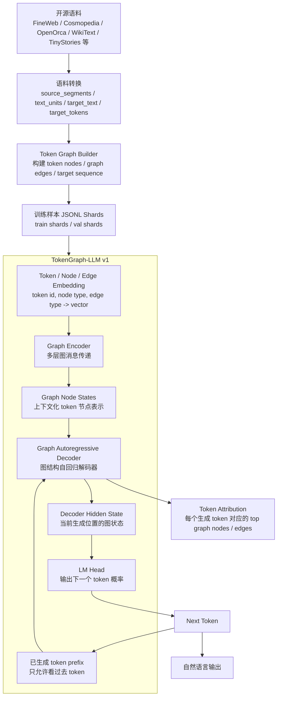
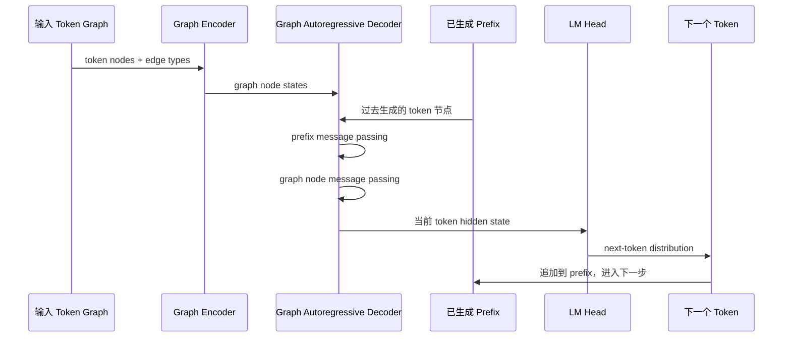
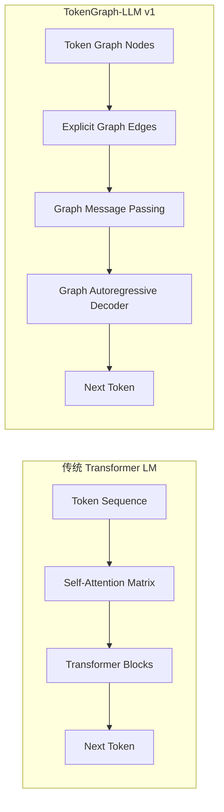

# TokenGraph-LLM v1 架构运行图

当前目标：训练一个实验性的图结构语言模型。它不是 TMCRA 记忆召回模块，也不是外部 LLM 包装层，而是尝试用 token 级图消息传递来完成自然语言生成。

## 总体运行链路



## 单步生成过程



## 当前模型内部模块

| 模块 | 作用 | 是否属于 LLM 主链路 |
|---|---|---|
| `token_emb` | token id 映射到向量 | 是 |
| `node_type_emb` | 节点类型映射到向量 | 是 |
| `edge_type_emb` | 边类型映射到向量 | 是 |
| `TokenGraphEncoder` | 对输入 token graph 做多层图消息传递 | 是 |
| `GraphAutoregressiveDecoder` | 用图消息传递生成下一个 token | 是 |
| `LM Head` | 从 decoder hidden state 输出 token 概率 | 是 |
| `token_path_loss` | 弱辅助：让生成位置能对齐相关 token graph node | 辅助 |
| `transition_path_loss` | 弱辅助：让模型学习 token-to-token 图转移 | 辅助 |
| `token attribution` | 可视化每个输出 token 依赖的图节点/边 | 分析工具 |

## 训练目标

主目标必须是自然语言建模：

```text
lm_loss = next-token prediction loss
```

辅助目标只用于帮助图路径学习语言结构：

```text
token_path_loss       = 当前目标 token 与图节点路径对齐
transition_path_loss  = 上一个 token -> 当前 token 的图边转移一致性
```

总损失：

```text
loss =
  lm_loss
  + token_path_weight * token_path_loss
  + transition_path_weight * transition_path_loss
```

当前大模型训练配置：

```text
dim = 384
graph_layers = 6
decoder_layers = 8
untied_embedding = true
batch_size = 4
grad_accum = 4
token_path_weight = 0.03
transition_path_weight = 0.02
```

## 和 Transformer 的区别



核心差异：

```text
Transformer:
  token 之间的关系主要由 attention 动态学习，内部路径不直接等于显式图结构。

TokenGraph-LLM:
  token 之间先被构造成显式 graph nodes / graph edges，
  生成时可以追踪每个 token 依赖哪些 graph node / graph edge。
```

## 可解释性边界

可见：

```text
输入有哪些 token nodes
节点之间有哪些 edges
每个生成 token 的 top graph nodes
每个 top node 的 incident edges
token path / transition path 的训练指标
```

仍然不可完全解释：

```text
embedding 向量内部语义
Linear / GELU / LayerNorm 的非线性变换
多层消息传递后的 hidden state 具体含义
```

因此准确表述应为：

```text
不是完全无黑箱，但具备 token-level graph reasoning trace。
每个生成 token 可以追踪到显式图节点和图路径。
```

## 当前阶段定位

当前阶段不宣称已经训练出成熟 LLM。

更准确定位：

```text
TokenGraph-LLM v1 是一个 graph-native language model prototype。
目标是证明不用 Transformer self-attention，也可以通过 token-level graph message passing 学习自然语言生成信号。
```

