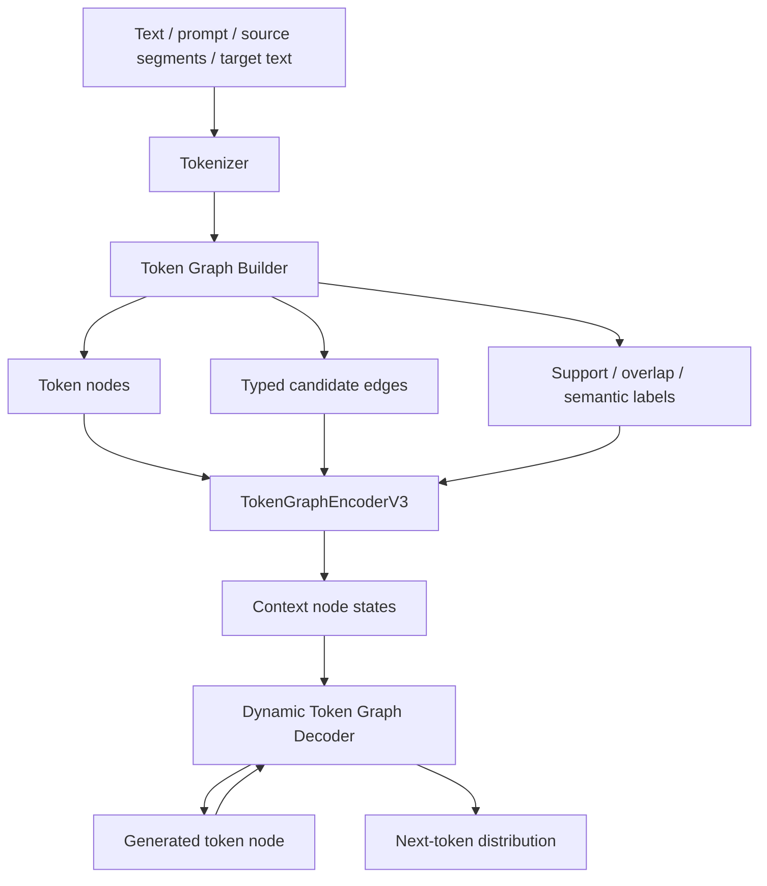

# TGCLM Stage C Technical Overview

Date: 2026-06-06  
Version: Stage C / Dynamic Token Graph Decoder V3  
Status: experimental graph-native language model prototype

## What TGCLM Is

TGCLM stands for **Token Graph Causal Language Model**.

It is an experimental non-Transformer autoregressive language model. Instead of
using dense Transformer self-attention, TGCLM represents prompt tokens, context
tokens, semantic spans, and generated tokens as graph nodes. Candidate token
relations are represented as typed edges, and the model learns which edges
should participate in generation through learned edge gates and dynamic graph
decoding.

The current Stage C checkpoint is not a production LLM. It is a research
prototype showing that a graph-native model can be trained with next-token
prediction and graph-alignment objectives, and that graph structure measurably
changes the generated text.

## Current Stage C Model

Latest checkpoint:

```text
token_graph_dynamic_decoder_v3.pt
```

Architecture:

| Field | Value |
|---|---:|
| Parameters | 114,615,372 |
| Hidden dimension | 512 |
| Graph encoder layers | 8 |
| Dynamic graph decoder layers | 10 |
| Max generated tokens during training | 160 |
| Embeddings | untied |
| Training precision | bf16 |
| Training steps | 62,000 |

`heads=8` exists as a compatibility/configuration field, but the Stage C model
does not use Transformer multi-head self-attention.

## Architecture



## Token Graph Builder

The graph builder converts text records into token-level graphs.

Preferred input fields:

```json
{
  "query": "prompt or question",
  "source_segments": [
    {"segment_id": "seg1", "text": "source text"}
  ],
  "text_units": [
    {"unit_id": "u1", "text": "optional unit text"}
  ],
  "target_text": "text to generate"
}
```

The builder emits:

- token nodes;
- node type ids;
- typed candidate edges;
- target token ids;
- optional semantic span/edge supervision;
- support and answer-overlap labels.

The builder provides candidate structure only. It does not decide the final
reasoning path. The graph model learns edge activation during training.

## Graph Encoder

Each node starts as:

```text
h_i^0 = LayerNorm(TokenEmb(token_i) + NodeTypeEmb(type_i))
```

Each edge has an edge type embedding:

```text
r_e = EdgeTypeEmb(edge_type_e)
```

For every graph layer, TGCLM learns an edge gate:

```text
g_e = sigmoid(MLP([h_src, h_dst, r_e]))
```

Messages are propagated only through candidate graph edges:

```text
m_e = MLP([h_src, r_e]) * g_e
```

The target node receives a gated aggregate:

```text
agg_i = mean({m_e | dst(e)=i}, weighted by g_e)
```

The node state is updated as:

```text
h_i^{l+1} = LayerNorm(h_i^l + MLP([h_i^l, agg_i]))
```

## Dynamic Graph Decoder

Generated tokens are also graph nodes. At each generation step, the decoder
combines:

1. message from previously generated token nodes;
2. message from encoded context graph nodes;
3. learned node prior from context-token and answer-overlap scores.

The decoder is graph-native. It does not call an external LLM at inference time.

## Training Objectives

Stage C uses a multi-objective loss:

```text
L = L_lm
  + 0.35 * L_graph_state
  + support_weight * L_support
  + overlap_weight * L_overlap
  + tunnel_weight * L_tunnel
  + 0.08 * L_next_token_node
  + 0.05 * L_edge
```

Main components:

- next-token cross entropy;
- graph-state token prediction;
- support-node scoring;
- answer-overlap scoring;
- decoder-to-context tunnel alignment;
- next-token-to-node alignment;
- edge-type prediction.

## Stage C Evaluation Smoke

Stage C was compared against Stage A/B and graph ablations.

| Model | Variant | Total loss | LM loss |
|---|---|---:|---:|
| Stage A | normal | 10.666509 | 7.587883 |
| Stage B | normal | 10.228030 | 7.297534 |
| Stage C | normal | 6.512117 | 4.641285 |
| Stage C | no_edges | 8.310654 | 5.790666 |
| Stage C | shuffle_edges | 7.702783 | 5.169387 |

The graph ablation is meaningful: removing or shuffling edges hurts Stage C.
This indicates that graph structure affects generation, not just storage.

TinyStories validation smoke:

| Variant | Avg words | Avg gold overlap |
|---|---:|---:|
| normal | 73.88 | 0.1835 |
| no_edges | 38.12 | 0.1499 |
| shuffle_edges | 63.62 | 0.1618 |

BLiMP likelihood smoke:

| Task | Accuracy |
|---|---:|
| determiner_noun_agreement_1 | 59% |
| anaphor_number_agreement | 63% |
| regular_plural_subject_verb_agreement_1 | 64% |

## Current Capability Boundary

What works:

- early English generation;
- story-style continuation;
- measurable graph-edge impact;
- weak grammar preference on BLiMP smoke tasks;
- token attribution from generated tokens to graph nodes.

What does not work yet:

- reliable factual QA;
- stable long-range reasoning;
- robust instruction following;
- strong grammar;
- mature general-purpose LLM behavior.

The accurate claim is:

> Stage C validates the trainability of a graph-native causal language model and
> shows that token graph edges affect next-token generation. It is still an
> early research prototype, not a production-ready LLM.

## Recommended Next Steps

- Run full BLiMP / BabyLM style likelihood evaluations.
- Add stronger graph-token grounding losses.
- Expand semantic graph teacher data from 9k rows toward 30k-100k rows.
- Run ablations for semantic edges, tunnel loss, next-token-node loss, tied vs
  untied embeddings, and larger dimensions/layer counts.
