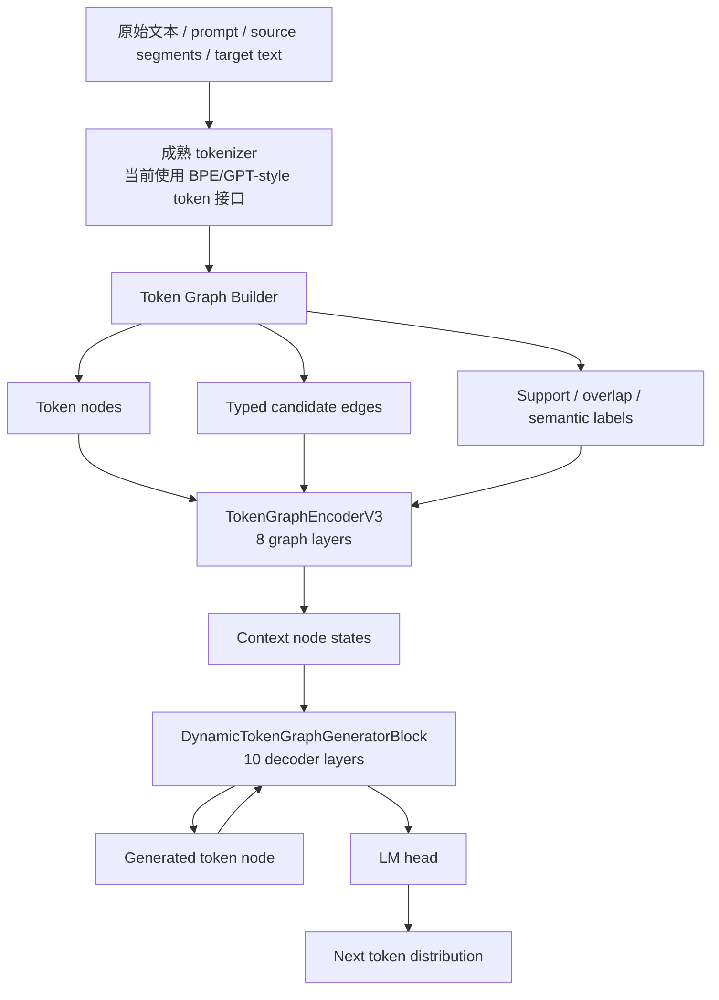

# TGCLM Stage C 技术文档

日期：2026-06-06  
版本：Stage C / Dynamic Token Graph Decoder V3  
状态：实验性语言模型路线，不等同于原 TMCRA 长记忆运行时

## 1. 项目定位

TGCLM，全称可以暂定为 **Token Graph Causal Language Model**。它是从 TMCRA 图记忆算法延伸出的另一条技术路线：把原来“事件级、记忆级、路径级”的图推理思想下沉到 **token 级语言生成**。

当前目标不是做检索增强，也不是做 embedding 相似度召回，而是训练一个 **图结构原生的自回归语言模型**：

- 输入文本被拆成 token，并构造成 token graph；
- token 之间存在显式候选边，例如顺序边、同 token 边、语义边、知识边；
- 模型学习每条候选边是否应该参与推理；
- 生成 token 时，新生成 token 也作为图节点进入动态解码过程；
- 输出自然语言由图模型自身产生，不依赖 Transformer decoder。

一句话定义：

> TGCLM 是一个非 Transformer 的 token-level graph-native causal language model，用图消息传递、边门控、路径隧穿和动态图 token 解码来学习 next-token generation。

## 2. 当前最新模型

最新 checkpoint：

```text
checkpoint/token_graph_dynamic_decoder_v3.pt
```

本地主要代码目录：

```text
src/token_graph_llm
```

核心文件：

```text
model_token_graph_dynamic_decoder_v3.py
train_token_graph_dynamic_decoder_v3.py
build_native_token_reasoning_graph_dataset_v3.py
TOKEN_LEVEL_SEMANTIC_GRAPH_SCHEMA.md
```

当前 Stage C 模型配置：

| 项目 | 值 |
|---|---:|
| 参数量 | 114,615,372 |
| dim | 512 |
| graph_layers | 8 |
| decoder_layers | 10 |
| heads 参数 | 8 |
| max_answer_tokens | 160 |
| embedding | untied |
| AMP | bf16 |
| batch_size | 4 |
| grad_accum_steps | 4 |
| max_steps | 62,000 |
| label_smoothing | 0.02 |
| graph_state_weight | 0.35 |
| next_token_node_weight | 0.08 |
| edge_type_weight | 0.05 |

说明：`heads=8` 目前是配置参数，但当前 V3 主体没有 Transformer-style multi-head attention。它保留为结构参数入口，不代表模型使用 Transformer attention。

## 3. 总体架构

TGCLM 当前由五层组成：

1. Tokenizer
2. Token Graph Builder
3. Token Graph Encoder
4. Dynamic Graph Decoder
5. Multi-objective Training Loss



核心区别：

- Transformer 是 dense attention over sequence；
- TGCLM 是 sparse typed graph message passing over token nodes；
- Transformer 每层计算所有 token 对之间的注意力；
- TGCLM 每层只沿候选边传播，并学习边是否激活。

## 4. Tokenizer 层

当前方向已经确定：tokenizer 可以使用成熟 tokenizer，不作为核心创新点。

原因：

- 手写规则 tokenizer 会把系统变成规则工程；
- tokenizer 只是文本离散化入口；
- 语言规律、token 关系、next-token 行为必须由图模型学习。

当前代码支持：

- 自训练 char-BPE；
- Hugging Face BPE tokenizer JSON；
- GPT-style tokenizer 作为成熟 tokenization 入口。

注意：使用成熟 tokenizer 不等于使用 Transformer。只要后续模型主体不是 Transformer attention，就不会改变 TGCLM 的架构路线。

## 5. Token Graph Builder

Builder 的任务不是回答问题，而是把文本变成可训练图。

输入 schema 主要字段：

```json
{
  "query": "prompt or question",
  "source_segments": [
    {"segment_id": "seg1", "text": "source text"}
  ],
  "text_units": [
    {"unit_id": "u1", "text": "optional unit text"}
  ],
  "target_text": "text to generate"
}
```

Builder 输出：

```json
{
  "nodes": [],
  "edges": [],
  "target_ids": [],
  "node_type_vocab": {},
  "edge_type_vocab": {}
}
```

### 5.1 节点类型

当前节点以 token 为核心，包括：

- query token；
- context/source token；
- text unit token；
- knowledge token；
- semantic span token；
- target prefix token。

其中 `target_prefix_token` 是训练时 teacher-forcing 节点。它不能作为普通上下文证据泄漏给模型，所以训练 collate 阶段会把这些节点从 encoder context 中 mask 掉，只保留其因果训练用途。

### 5.2 边类型

基础边：

- `next_token`
- `prev_token`
- `same_piece`
- `query_context_overlap`
- `query_unit_overlap`
- `context_unit_overlap`

语义边：

- `semantic_same_entity`
- `semantic_entity_attribute`
- `semantic_relation`
- `semantic_cause_effect`
- `semantic_condition_result`
- `semantic_temporal`
- `semantic_definition`
- `semantic_example`
- `semantic_contrast`
- `semantic_part_whole`
- `semantic_quantity`
- `semantic_coreference`
- `semantic_support`
- `semantic_negative`
- `semantic_tunnel`

这些边只是候选关系，不是最终推理结果。真正决定边是否参与的是模型里的 learned edge gate。

## 6. Token Graph Encoder

Encoder 是 `TokenGraphEncoderV3`。

输入：

- `node_token_ids`
- `node_types`
- `edge_src`
- `edge_dst`
- `edge_types`
- `node_mask`
- `edge_mask`

每个 token node 的初始表示：

```text
h_i^0 = LayerNorm(TokenEmb(token_i) + NodeTypeEmb(type_i))
```

每条边有 edge type embedding：

```text
r_e = EdgeTypeEmb(edge_type_e)
```

每个 graph layer 使用 learned edge gate：

```text
g_e = sigmoid(MLP([h_src, h_dst, r_e]))
```

消息：

```text
m_e = MLP([h_src, r_e]) * g_e
```

聚合到目标节点：

```text
agg_i = mean({m_e | dst(e)=i}, weighted by g_e)
```

节点更新：

```text
h_i^{l+1} = LayerNorm(h_i^l + MLP([h_i^l, agg_i]))
```

因此，Builder 提供的是候选图；模型训练的是 **边激活、消息传播、节点状态演化**。

## 7. Dynamic Graph Decoder

Decoder 是当前架构最关键的部分。

它不是 Transformer decoder。它把已经生成的 token 也视为图节点，然后让生成节点和上下文图节点发生消息交互。

每一步生成时：

1. 已生成 token 序列形成 answer node states；
2. answer node 之间通过 prefix graph message 传递；
3. answer node 与 context graph node 通过 context graph message 交互；
4. 经过多层 dynamic graph decoder block；
5. 最后用 `lm_head` 输出 next-token distribution。

### 7.1 Prefix Graph Message

生成 token 内部不是 attention，而是有限窗口内的图式 prefix message。

对当前位置 `t`，它只看前面窗口内的生成节点：

```text
P_t = {y_{t-k}, ..., y_{t-1}}
```

前缀边权由 gate 学习：

```text
alpha_{j,t} = softmax(MLP([a_j, a_t, r_prefix]))
```

prefix message：

```text
p_t = sum_j alpha_{j,t} a_j
```

### 7.2 Context Graph Message

生成节点还会连接到上下文图节点：

```text
beta_{i,t} = softmax(MLP([h_i, a_t, r_context]) + context_prior_i)
```

context message：

```text
c_t = sum_i beta_{i,t} h_i
```

最终更新：

```text
a_t' = LayerNorm(a_t + MLP([a_t, p_t, c_t]))
```

这里的 `context_prior` 来自：

```text
context_prior_i = context_token_score_i + answer_overlap_score_i
```

它不是外部检索分数，而是模型内部对上下文节点参与生成的打分。

## 8. 隧穿机制在 TGCLM 中的变化

原 TMCRA 里的隧穿用于记忆链路穿透：跨轮次、跨事件、跨 profile/temporal/unit 的软连接。

TGCLM 中，隧穿下沉到 token 级：

- query token 与 source token 可以形成 overlap/tunnel；
- semantic span token 之间可以形成 semantic tunnel；
- generated token 可以通过 decoder tunnel 连接 context token；
- next-token-node loss 约束生成位置去找对应 token node。

这意味着 TGCLM 的“推理路径”不是一句话级别，而是 token 节点到 token 节点的动态图路径。

## 9. 训练目标

当前训练不是单一 next-token loss，而是多目标联合训练。

### 9.1 Next-token LM Loss

主目标：

```text
L_lm = CE(logits_t, y_t)
```

这是语言生成能力的基础。

### 9.2 Graph State Loss

当前 `graph_state_logits` 与 `lm_logits` 共用输出形式，用于保持图状态也面向 token 预测：

```text
L_graph_state = CE(graph_state_logits_t, y_t)
```

权重：`graph_state_weight = 0.35`

### 9.3 Support / Overlap Loss

训练节点是否是 support / answer overlap：

```text
L_support = BCE(context_token_score_i, support_label_i)
L_overlap = BCE(answer_overlap_score_i, overlap_label_i)
```

作用：让图节点不仅有 token 表示，还学习“是否对生成有用”。

### 9.4 Tunnel Loss

训练生成位置与上下文节点之间的软连接：

```text
L_tunnel = BCE(tunnel_logits_{t,i}, support_label_i)
```

作用：让 decoder 在生成每个 token 时学习连接上下文图。

### 9.5 Next-token-node Loss

当目标 token 在上下文图中有对应 positive node 时，训练该生成位置去绑定那些节点：

```text
L_next_node = -log sum_i P(node_i | y_t)
```

条件：

```text
node_i is positive if support_label_i or answer_overlap_label_i
and token(node_i) == target_token_t
```

权重：`next_token_node_weight = 0.08`

### 9.6 Edge Type Loss

训练边类型预测：

```text
L_edge = CE(edge_type_logits_e, edge_type_e)
```

权重：`edge_type_weight = 0.05`

### 9.7 总损失

当前整体形式：

```text
L = L_lm
  + 0.35 * L_graph_state
  + support_weight * L_support
  + overlap_weight * L_overlap
  + tunnel_weight * L_tunnel
  + 0.08 * L_next_node
  + 0.05 * L_edge
```

## 10. 数据与训练阶段

当前训练分三阶段。

### Stage A

数据：

```text
30k simple + 3k semantic teacher, semantic repeated 4x
```

目标：

- 验证 v3 架构可训练；
- 验证 target prefix causal masking；
- 验证语义图样本能进入训练。

### Stage B

数据：

```text
100k simple + 9.2k semantic teacher, semantic repeated 3x
```

目标：

- 扩大基础语言学习；
- 保留高质量 semantic teacher 样本比例；
- 从 Stage A checkpoint 继续训练。

### Stage C

数据：

```text
约 1,035,272 effective samples
simple+ 全量 shard + semantic teacher shard repeated 5x
```

训练：

```text
streaming train
bf16
batch_size=4
grad_accum_steps=4
max_steps=62000
```

目标：

- 让模型从小规模 smoke 进入百万级语言建模；
- 验证图边是否在更大训练量下真正影响生成；
- 观察是否出现初步自然语言生成能力。

## 11. 当前评估结果

### 11.1 Stage A/B/C 对比

评估输出：

```text
docs/STAGEC_DETAILED_BENCHMARK_SMOKE_20260606.md
```

| model | variant | total loss | lm loss | next-token-node loss | edge loss |
|---|---:|---:|---:|---:|---:|
| StageA | normal | 10.666509 | 7.587883 | 4.073114 | 0.112114 |
| StageB | normal | 10.228030 | 7.297534 | 3.453571 | 0.032078 |
| StageC | normal | 6.512117 | 4.641285 | 1.904560 | 0.052688 |
| StageC | no_edges | 8.310654 | 5.790666 | 4.776376 | 0.000000 |
| StageC | shuffle_edges | 7.702783 | 5.169387 | 4.099638 | 5.650196 |

结论：

- Stage C 明显强于 Stage A/B；
- Stage C normal 明显优于 no_edges 和 shuffle_edges；
- 图边对生成行为有实质贡献；
- 但生成质量仍然不稳定。

### 11.2 TinyStories Validation Smoke

评估输出：

```text
release asset eval/tinystories_stagec_smoke.json or local eval output
```

| variant | avg_words | unique_word_ratio | repeated_bigrams | avg_gold_overlap |
|---|---:|---:|---:|---:|
| normal | 73.88 | 0.8089 | 0.75 | 0.1835 |
| no_edges | 38.12 | 0.8806 | 0.12 | 0.1499 |
| shuffle_edges | 63.62 | 0.8092 | 0.62 | 0.1618 |

解释：

- normal 图条件下生成更长；
- no_edges 生成明显变短；
- shuffle_edges 改变内容轨迹；
- 说明图结构不是装饰项，确实在调制生成。

问题：

- 故事风格可见；
- 部分实体可延续；
- 事实链经常漂移；
- 长生成后半段容易跑偏。

### 11.3 BLiMP Likelihood Smoke

评估输出：

```text
release asset eval/ or local eval output
```

| 子任务 | 样本数 | accuracy |
|---|---:|---:|
| determiner_noun_agreement_1 | 100 | 59% |
| anaphor_number_agreement | 100 | 63% |
| regular_plural_subject_verb_agreement_1 | 100 | 64% |

解释：

- 模型已经有弱语法偏好；
- 结果高于随机；
- 但距离稳定语言模型仍较远。

## 12. 当前能力边界

已经具备：

- 可生成比 Stage A/B 更长、更自然的英文；
- 图边对 loss 和生成都有明显影响；
- 能在 TinyStories smoke 中保持一部分故事风格；
- 能在 BLiMP 小子集上表现出弱语法偏好；
- token attribution 可展示生成 token 对应的 top graph nodes / edges。

尚未具备：

- 稳定事实绑定；
- 稳定长链推理；
- 稳定问答能力；
- 高质量 instruction following；
- 接近通用小型 LLM 的语法和知识能力。

当前最准确判断：

> Stage C 已经证明 TGCLM 的图结构会影响语言生成，并且能训练出早期自然语言能力；但它还不是可用 LLM，更像一个已经跑通的 graph-native language model prototype。

## 13. 与 Transformer 的核心差异

Transformer：

```text
每层对 sequence 内 token 做 dense self-attention
复杂度约 O(n^2 * d)
```

TGCLM：

```text
每层沿 token graph candidate edges 做 message passing
复杂度约 O((N + E) * d)
```

其中：

- `N` 是节点数；
- `E` 是候选边数；
- 如果图保持稀疏，则 `E` 远小于 `N^2`；
- 如果 Builder 构出过密图，成本也会升高。

因此，TGCLM 的理论优势取决于能否构造高质量稀疏图，并训练模型学会激活正确边。

## 14. 当前主要技术问题

### 14.1 图边有效，但事实约束不够强

Stage C normal 优于 no_edges/shuffle_edges，说明边有效。

但 TinyStories 案例显示：模型会保留 `cow / farmer / boy / help / friend` 这类语义氛围，却会生成 `cow's tree` 这样的错误局部事实。

问题不是图完全没用，而是：

```text
图边能改变生成方向，但还不能稳定约束生成事实。
```

### 14.2 语言先验开始形成，但还很弱

BLiMP 59%-64% 说明模型有初步语法偏好，但偏好不稳定。

错误例子：

```text
good: Raymond is selling this sketch.
bad : Raymond is selling this sketches.
```

模型有时会给 bad sentence 更低 loss，说明局部语法约束没有学稳。

### 14.3 长生成容易漂移

生成越长，越容易从 prompt graph 的事实链漂移到常见童话模板。

这说明 decoder 仍然存在局部 token transition inertia，需要更强的 graph-token grounding。

## 15. 下一步建议

优先级 1：补正式 likelihood adapter。

- 跑完整 BLiMP；
- 跑 BabyLM 子集；
- 跑 TinyStories perplexity；
- 跑 WikiText-style perplexity。

优先级 2：加强 graph-token grounding。

建议增加：

```text
fact path consistency loss
graph-token alignment loss
generated-token-to-source-node contrastive loss
edge activation sparsity / stability loss
```

目标不是把模型变成检索器，而是让生成位置更稳定地绑定正确图路径。

优先级 3：扩大高质量 semantic graph 数据。

当前 semantic teacher 数据只有 9.2k 级别，Stage C 虽然重复采样，但真实语义图覆盖仍不足。建议下一轮：

```text
30k-100k semantic teacher graph rows
```

并且覆盖：

- story continuation；
- factual QA；
- definition/explanation；
- causal reasoning；
- temporal reasoning；
- entity attribute binding；
- coreference；
- quantity relation。

优先级 4：做结构消融。

至少比较：

- no_edges；
- shuffle_edges；
- no semantic edges；
- no next-token-node loss；
- no tunnel loss；
- no graph_state loss；
- tied vs untied embedding；
- graph_layers 8 vs 12；
- decoder_layers 10 vs 12/16；
- dim 512 vs 768。

## 16. 对外表述建议

可以说：

> We release an experimental graph-native causal language model prototype. Unlike Transformer decoders, TGCLM represents prompt tokens, context tokens, and generated tokens as graph nodes, and learns typed edge activation and dynamic graph decoding for next-token generation.

中文：

> TGCLM 是一个实验性的图原生因果语言模型。它不使用 Transformer attention，而是把输入 token 和生成 token 都表示为图节点，通过候选边、边门控、路径隧穿和动态图解码来学习自然语言生成。

不要说：

```text
已经超过 Transformer
已经是可用 LLM
已经解决自然语言推理
```

更准确的说法：

```text
已经验证了一条非 Transformer、图原生语言模型路线的可训练性；
Stage C 显示图边对 next-token generation 有实际影响；
当前仍处于早期原型阶段，需要继续解决事实绑定、语法稳定性和长生成漂移。
```

## 17. 文件索引

模型代码：

```text
src/token_graph_llm/model_token_graph_dynamic_decoder_v3.py
```

训练脚本：

```text
src/token_graph_llm/train_token_graph_dynamic_decoder_v3.py
```

图构建脚本：

```text
scripts/build_native_token_reasoning_graph_dataset_v3.py
```

语义图 schema：

```text
docs/TOKEN_LEVEL_SEMANTIC_GRAPH_SCHEMA.md
```

Stage C benchmark smoke：

```text
docs/STAGEC_DETAILED_BENCHMARK_SMOKE_20260606.md
```
